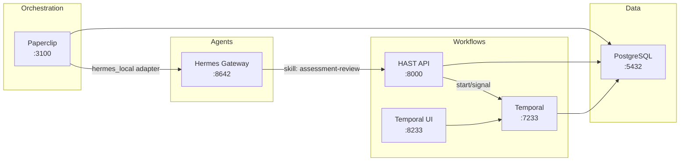

# Lecture Agentic AI — v0.11

> Part of the [Lecture](https://www.edtpartners.com/lecture) ecosystem by [EDT&Partners](https://www.edtpartners.com) — The First Open-Source GenAI Framework for Education

The agentic AI layer for EDT&Partners' Lecture platform. Adds autonomous multi-agent capabilities to Lecture: Paperclip orchestrates Hermes AI agents with education-specific skills (assessment review, curriculum compliance, enrollment evaluation, knowledge augmentation). HAST provides durable human-in-the-loop workflows via Temporal so that professors and administrators always have final approval over AI-generated evaluations.

Used alongside Lecture's existing capabilities (Content Chat, Questions Generator, Evaluations & Rubrics, In-doc Translation) at institutions including Universidad de Deusto, Universite du Luxembourg, UFV, ESIC, and EOI.



## Cross-Industry Platform

Lecture Agentic AI serves multiple verticals with the same core platform:

| Industry | Company Template | Example Agents | Use Cases |
|----------|-----------------|---------------|-----------|
| **Education** | `higher-ed` | Assessment Quality, Curriculum Compliance, Knowledge Curator | Rubric evaluation, accreditation compliance, knowledge graph |
| **Healthcare** | `healthcare` | Documentation Quality, Healthcare Compliance | Clinical note review, HIPAA/Joint Commission compliance |
| **Government** | *(planned)* | *(planned)* | Inspection review, regulatory compliance |

Platform-level code uses industry-neutral terminology (`submission`, `evaluation`, `review`). Industry-specific language belongs only in company templates and Hermes skills/agents.

## Quick Start

```bash
# 1. Clone and configure
git clone <repo-url> && cd lecture-agentic-ai
cp .env.example .env          # Fill in API keys

# 2. Start all services
docker compose up --build

# 3. Open the UIs
open http://localhost:3100     # Paperclip (orchestration + org chart)
open http://localhost:3200     # Reviewer Dashboard (pending reviews)
open http://localhost:8233     # Temporal (workflow visibility)
```

## Services

| Service | Port | Technology | Purpose |
|---------|------|-----------|---------|
| **Paperclip** | 3100 | Node.js / React | Orchestration UI, org chart, governance, budgets |
| **Hermes Gateway** | 8642 | Python | OpenAI-compatible LLM inference API |
| **HAST API** | 8000 | Python / FastAPI | Human-in-the-loop review REST API |
| **HAST Worker** | -- | Python / Temporal SDK | Executes workflow activities |
| **Reviewer Dashboard** | 3200 | HTML / JS / nginx | Human reviewer UI for pending submissions |
| **Temporal Server** | 7233 | Go | Durable workflow orchestration |
| **Temporal UI** | 8233 | TypeScript / React | Workflow visibility dashboard |
| **PostgreSQL** | 5432 | PostgreSQL 17 | Shared database (3 databases) |
| **Seed Instructions** | -- | Python (one-shot) | Auto-seeds SOUL.md into Paperclip DB on startup |

---

## Why This Stack? Platform Comparison

### Orchestration: Paperclip vs Alternatives

| Capability | Paperclip + Hermes | OpenClaw | ChatGPT / Assistants API |
|---|---|---|---|
| **Org chart with hierarchy** | CEO → Managers → Workers with budget governance | Flat agent list | No org structure |
| **Agent heartbeats** | Scheduled + on-demand + webhook triggers | Manual triggers only | API call only |
| **Human-in-the-loop** | Built-in board approvals + HAST/Temporal workflows | No built-in approval | No workflow engine |
| **Cost governance** | Per-agent budgets, token tracking, spend limits | No cost controls | Usage-based, no per-agent tracking |
| **Durable workflows** | Temporal: crash-resistant, 7-day wait, signals | No workflow engine | No durable state |
| **Skills system** | Hermes: 80+ loadable skills + custom SKILL.md | Limited tools | Function calling only |
| **Session persistence** | Hermes `--resume` across heartbeats | No session memory | Thread-based (limited) |
| **Multi-provider LLM** | 8 providers (OpenCode Go, OpenRouter, Anthropic, etc.) | OpenAI only | OpenAI only |
| **Self-hosted** | Full Docker Compose, own infrastructure | Cloud-hosted | Cloud-hosted |
| **Open source** | Paperclip (MIT), Hermes (MIT), Temporal (MIT) | Proprietary | Proprietary |

### Agent Runtime: Hermes vs Alternatives

| Feature | Claude Code | Codex | Hermes Agent |
|---|---|---|---|
| Persistent memory | No | No | Remembers across sessions |
| Native tools | ~5 | ~5 | 30+ (terminal, file, web, browser, vision, git, etc.) |
| Skills system | No | No | 80+ loadable skills |
| Session search | No | No | FTS5 search over past conversations |
| Sub-agent delegation | No | No | Parallel sub-tasks |
| Context compression | No | No | Auto-compresses long conversations |
| MCP client | No | No | Connect to any MCP server |
| Multi-provider | Anthropic only | OpenAI only | 8 providers out of the box |

### Why Temporal for Workflows?

| Feature | Temporal | Cron jobs | Queue (Redis/RabbitMQ) | No workflow engine |
|---|---|---|---|---|
| Crash recovery | Automatic resume | Lost on crash | Message requeue | Lost |
| Long waits (days) | Native `wait_condition` | Sleep/poll loop | TTL issues | Not possible |
| Human signals | Built-in signals | Not supported | Manual | Not possible |
| Audit trail | Full execution history | Log files | Message logs | None |
| Retry policies | Configurable per activity | Manual | Basic retry | Manual |
| Visibility UI | Temporal UI dashboard | None | Provider-specific | None |

---

## FAQ

### What triggers an agent to run?

Five mechanisms:
1. **Scheduled heartbeat** — timer fires on interval (e.g., every 2 hours)
2. **Issue assignment** — assigning an issue to an agent triggers an immediate wakeup
3. **@-mention** — mentioning an agent in a comment triggers a wakeup
4. **Manual "Run Heartbeat"** — click the button in the Paperclip UI
5. **Inbound webhook (Routines)** — external HTTP POST creates an issue and triggers the agent

### Can external systems trigger agent work?

Yes. Paperclip supports **Routines** (inbound webhooks) where an external system (LMS, student portal, API) sends an HTTP POST that creates an issue and triggers the assigned agent. This enables the pattern: "customer starts a request → Paperclip orchestrates agents to handle it."

### Is this only for autonomous "run forever" goals?

No, it supports both modes:
- **Proactive:** CEO agent wakes on heartbeat, checks for work, self-triages, delegates to team
- **Reactive:** Agents only run when they have assigned issues. External events (webhooks, manual issue creation, @-mentions) trigger specific work.

### What are Projects, Goals, and Issues?

- **Goals** = strategic objectives ("Ensure 100% accreditation compliance by Q3")
- **Projects** = groups of related work ("Spring 2026 Assessment Review")
- **Issues** = individual tasks agents work on ("Review CS101 Midterm — Student #12345")

### What can Paperclip do?

- Orchestrate teams of AI agents with an org chart and reporting hierarchy
- Track costs per agent with monthly budget ceilings
- Require board approval for agent hiring and strategic decisions
- Execute agents on scheduled heartbeats or on-demand triggers
- Show live transcripts of agent runs (every tool call, every decision)
- Manage issues, projects, and goals that agents work on

### What can't Paperclip do (yet)?

- **Not a fully autonomous company** — requires human supervision, board approvals, and prompt engineering
- **No production distributed mode** — single-machine deployment only
- **Agent prompt engineering is hard** — agents need very explicit instructions (the "Memento Man" problem: they forget everything between heartbeats)
- **Security scanner friction** — Hermes's tirith scanner blocks `curl | python3` patterns, requiring workarounds
- **Early-stage ecosystem** — launched March 2026, documentation gaps, API changes

### How does HAST fit in?

HAST (Hermes Agent Solution Template) provides the **human-in-the-loop workflow layer**. When an AI agent evaluates a student submission, it submits the evaluation to HAST which starts a Temporal workflow. The workflow waits up to 7 days for a professor to approve, reject, or request revision. This ensures AI never makes final academic decisions.

---

## Company Template

The default deployment uses the **Lecture AI Operations Center** template with four agents:

- **AI Operations Director** -- strategic coordination, task delegation
- **Assessment Quality Agent** -- evaluates submissions, routes to HAST for professor review
- **Curriculum Compliance Agent** -- reviews syllabi against accreditation standards
- **Knowledge Curator Agent** -- maintains institutional knowledge graph

## Documentation

| Document | Description |
|----------|-------------|
| [Architecture](docs/ARCHITECTURE.md) | System design, communication patterns, security model |
| [API Reference](docs/API.md) | HAST API endpoints, request/response examples |
| [Data Model](docs/DATA_MODEL.md) | Database schema, ER diagram, status enums |
| [Workflows](docs/WORKFLOWS.md) | Temporal workflow deep dive, activities, signals |
| [Deployment](docs/DEPLOYMENT.md) | Local dev, Docker Compose, production VPS setup |
| [Customization](docs/CUSTOMIZATION.md) | Adding skills, agents, workflows, endpoints |
| [Agent Configuration](docs/AGENT_CONFIGURATION.md) | SOUL.md files, prompt templates, Memento Man pattern |
| [Demo Script](docs/DEMO_SCRIPT.md) | Step-by-step demo walkthrough |
| [Docs Index](docs/README.md) | Full documentation index with reading order |

## License

Proprietary -- EDT&Partners ([edtpartners.com](https://www.edtpartners.com)). Part of the [Lecture](https://www.edtpartners.com/lecture) platform. All rights reserved.
