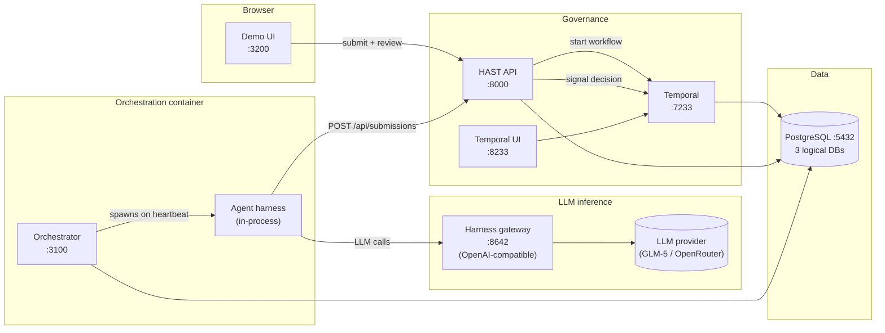
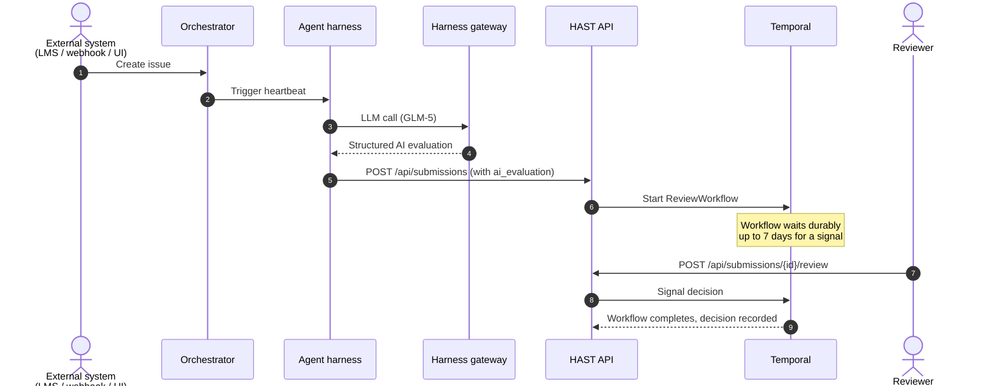

# Lecture Agentic AI

> **Note.** *"Lecture"* is a **fictional product name** used throughout this
> repo as a stand-in for "any consumer of agent capabilities". The repo is a
> public reference implementation; nothing here is tied to a real customer or
> product.

A reference deployment that wires together four moving parts behind a single
`docker compose up`:

1. **Demo UI** — landing page, live pipeline, reviewer queue.
2. **Orchestrator** — assigns work, runs heartbeats, holds the org chart and
   per-agent budgets.
3. **Managed agent harness** — the LLM loop: tool calls, memory, skills,
   structured outputs.
4. **Durable workflow + human-in-the-loop layer** (HAST API + Temporal) — the
   AI evaluation is suggested, never final; a human signs off.

The current concrete implementation uses [Paperclip](https://github.com/paperclipai/paperclip)
as the orchestrator and [Hermes Agent](https://github.com/NousResearch/hermes-agent)
as the harness, but the repo is structured so that other harness backends can
slot in — see [Next Steps](#next-steps--pluggable-harness-layer) below.

---

## Architecture at a glance



---

## End-to-end submission flow



The AI evaluation lives in the harness layer, not in the Temporal workflow.
Temporal stays thin — it owns only the durable wait for a human and the
audit trail. (The `evaluate_submission` activity still exists as a fallback
for direct API submissions that arrive without a pre-computed evaluation.)

---

## Quick start

```bash
git clone https://github.com/fierro-ltd/lecture-agentic-ai.git
cd lecture-agentic-ai
cp .env.example .env          # Fill in OPENCODE_GO_API_KEY and OPENROUTER_API_KEY
docker compose up --build
```

Then open:

| URL | What you get |
|---|---|
| <http://localhost:3200> | Demo UI — landing page, live pipeline, reviewer queue |
| <http://localhost:3100> | Orchestrator admin (Paperclip) |
| <http://localhost:8000/docs> | HAST API Swagger docs |
| <http://localhost:8233> | Temporal UI (workflow visibility) |

A live demo is hosted at <https://lecture-agentic-ai.fierro.co.uk>.

The Orchestrator Admin requires a sign-in. The stack provisions a public
demo account on first boot:

| Field | Value |
|---|---|
| Email | `demo@example.com` |
| Password | `demo12345` |

These are not secrets — they are auto-created so anyone visiting the demo can
get past the login screen.

---

## Services

| Service | Port | Tech | Role |
|---|---|---|---|
| Demo UI | 3200 | static HTML / JS / nginx | Landing, pipeline visualisation, reviewer queue |
| Orchestrator | 3100 | Node.js / React (Paperclip) | Org chart, budgets, heartbeats, agent UI |
| Agent harness gateway | 8642 | Python (Hermes) | OpenAI-compatible LLM proxy used by the harness |
| HAST API | 8000 | Python / FastAPI | Submissions, decisions, Swagger at `/docs` |
| HAST Worker | — | Python / Temporal SDK | Executes workflow activities |
| Temporal Server | 7233 | Go | Durable workflow engine |
| Temporal UI | 8233 | TypeScript / React | Workflow visibility |
| PostgreSQL | 5432 | PostgreSQL 17 | One container, three databases |
| seed-instructions | — | Python (one-shot) | Seeds `SOUL.md` files into the orchestrator's DB on first boot |

The agent harness runs **as a process inside the orchestrator container**, not
as its own container. The harness gateway runs separately and only proxies
LLM API calls.

---

## Why this stack

The pieces are split along the boundaries of who owns *what kind of state*:

| Concern | Owned by | Why here and not elsewhere |
|---|---|---|
| LLM step (model + tools + skills + memory) | **Agent harness** (Hermes) | The harness is the only layer that should know about prompts, tool registries, and per-session memory. |
| Heartbeats, budgets, org chart, run transcripts | **Orchestrator** (Paperclip) | These are governance concerns about agents, not about LLMs. |
| Durable wait for a human (hours-to-days), retries, signals, audit | **Temporal + HAST** | Anything that must survive a process restart belongs in a workflow engine. |
| Submission state, reviewer decisions, REST surface | **HAST API** | A thin FastAPI service that owns the submissions table and brokers between callers and Temporal. |

The split lets each piece change independently. The harness can be swapped
(see Next Steps); the orchestrator can be replaced with a CLI; the workflow
layer can be re-pointed at a different durable engine without touching the
agent code.

### Comparison: managed agent harness options

| Capability | This repo (Hermes) | AWS Bedrock AgentCore harness | OpenAI managed agents | Anthropic Claude managed agents |
|---|---|---|---|---|
| Self-hosted | Yes (Docker) | No (AWS-managed microVMs) | No (OpenAI cloud) | No (Anthropic cloud) |
| Multi-provider LLMs | Yes (GLM-5, OpenRouter, etc.) | Bedrock-hosted models | OpenAI only | Claude only |
| Built-in memory | Session + persistent | Built-in memory store | Threads | Memory tool |
| Tool ecosystem | Local skills + MCP | Gateway + MCP + browser + code interpreter | Function calling + built-ins | Tool use + MCP |
| Sandbox isolation | Process-level | microVM per session | Provider-managed | Provider-managed |
| Cost model | Infra + token cost | Per-session AWS billing | Per-token + tool surcharges | Per-token + tool surcharges |
| Lock-in | Low (open source) | AWS account | OpenAI account | Anthropic account |

### Why a workflow engine for the human step

| Feature | Temporal | Cron job | Plain queue (Redis/RabbitMQ) | None |
|---|---|---|---|---|
| Crash recovery | Auto-resume mid-step | Job lost | Message redelivered | Lost |
| Wait for days for a signal | Native `wait_condition` | Sleep loop | TTL workarounds | Not possible |
| Receive a typed signal from outside | First-class `signal` API | Not supported | Manual plumbing | Not possible |
| Audit trail | Full execution history | Log files | Message logs | None |
| Per-step retry policy | Configurable | Manual | Basic | Manual |
| Visibility UI | Temporal UI | None | Provider-specific | None |

---

## Next steps — pluggable harness layer

Every agent system needs a **harness**: the orchestration loop that calls the
LLM, dispatches tool invocations, manages context, persists memory, and
recovers from errors. In this repo that harness is Hermes (Python), exposed
through a Hermes-Paperclip adapter that the orchestrator talks to. Hermes is
one concrete implementation of a "managed agent harness"; the orchestration
contract (model + tools + instructions in, traced steps + final output out)
is not unique to it.

Future work treats the harness as a pluggable backend behind a stable adapter
interface, so the orchestrator can route a given agent to a different harness
without changing the org chart, governance, or HAST workflow layer.

Candidate harness backends:

- **AWS Bedrock AgentCore harness** — managed, config-driven harness
  (model + tools + instructions) running each session in an isolated microVM
  with built-in memory, identity, gateway/MCP tools, browser, and code
  interpreter; powered by Strands Agents.
  Docs: <https://docs.aws.amazon.com/bedrock-agentcore/latest/devguide/harness.html>
- **OpenAI managed agents** — OpenAI-hosted runtime with built-in tools and
  state, for OpenAI-model-bound workloads.
- **Anthropic Claude managed agents** — Anthropic-hosted runtime, for
  Claude-model-bound workloads requiring native tool use, memory, and
  context management.

Other queued items:

- Move the orchestrator → harness adapter into a small typed package so other
  orchestrators (or a plain CLI) can use the same harness.
- Replace the seed-instructions one-shot with a Helm-style values file so the
  whole company template (agents, skills, SOUL files) is declarative.
- Add an OpenTelemetry exporter on the workflow side so HAST submissions and
  Temporal workflow steps appear together in a single trace.

---

## FAQ

**What triggers an agent to run?**
Five mechanisms: scheduled heartbeat, issue assignment, `@`-mention in a
comment, manual "Run heartbeat" button, or an inbound webhook (Routine).

**Can external systems trigger agent work?**
Yes — Routines (inbound webhooks) create an issue and trigger the assigned
agent. Pattern: *external request → orchestrator schedules agent → harness
evaluates → HAST waits for human.*

**Does Temporal call the AI?**
Not in this design. The harness layer owns the LLM step (so it gets the
orchestrator's governance: budgets, transcripts, scheduling). Temporal only
holds the durable wait for a human and the audit trail. A
fallback `evaluate_submission` activity exists for direct API submissions that
arrive without a pre-computed evaluation.

**Is this multi-tenant / production-grade?**
No. It is a single-machine reference deployment for showcasing the wiring.
There is intentionally no auth on the demo deployment — see the LICENSE for
the full disclaimer.

---

## Documentation

| Document | Description |
|---|---|
| [Architecture](docs/ARCHITECTURE.md) | System design, communication patterns, security model |
| [API Reference](docs/API.md) | HAST API endpoints, request/response examples |
| [Data Model](docs/DATA_MODEL.md) | Database schema, ER diagram, status enums |
| [Workflows](docs/WORKFLOWS.md) | Temporal workflow deep dive, activities, signals |
| [Deployment](docs/DEPLOYMENT.md) | Local dev, Docker Compose, production VPS setup |
| [Customization](docs/CUSTOMIZATION.md) | Adding skills, agents, workflows, endpoints |
| [Agent Configuration](docs/AGENT_CONFIGURATION.md) | `SOUL.md` files, prompt templates |
| [Demo Script](docs/DEMO_SCRIPT.md) | Step-by-step walkthrough |
| [Docs Index](docs/README.md) | Full documentation index with reading order |

---

## License

MIT — see [LICENSE](LICENSE).
