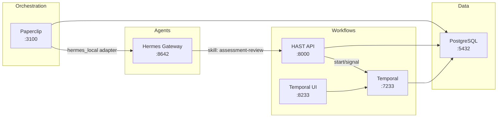

# Lecture Agent

An education-vertical multi-agent platform by EDT&Partners. Paperclip orchestrates Hermes AI agents equipped with education-specific skills (assessment review, curriculum compliance, enrollment evaluation, knowledge augmentation). HAST provides durable human-in-the-loop workflows via Temporal so that professors and administrators always have final approval over AI-generated evaluations.



## Quick Start

```bash
# 1. Clone and configure
git clone <repo-url> && cd lecture-agent
cp .env.example .env          # Fill in API keys

# 2. Start all services
docker compose up --build

# 3. Open the UIs
open http://localhost:3100     # Paperclip (orchestration + org chart)
open http://localhost:8233     # Temporal (workflow visibility)
```

## Services

| Service | Port | Technology | Purpose |
|---------|------|-----------|---------|
| **Paperclip** | 3100 | Node.js / React | Orchestration UI, org chart, governance, budgets |
| **Hermes Gateway** | 8642 | Python | OpenAI-compatible LLM inference API |
| **HAST API** | 8000 | Python / FastAPI | Human-in-the-loop review REST API |
| **HAST Worker** | -- | Python / Temporal SDK | Executes workflow activities |
| **Temporal Server** | 7233 | Go | Durable workflow orchestration |
| **Temporal UI** | 8233 | TypeScript / React | Workflow visibility dashboard |
| **PostgreSQL** | 5432 | PostgreSQL 17 | Shared database (3 databases) |

## Documentation

| Document | Description |
|----------|-------------|
| [Architecture](docs/ARCHITECTURE.md) | System design, communication patterns, security model |
| [API Reference](docs/API.md) | HAST API endpoints, request/response examples |
| [Data Model](docs/DATA_MODEL.md) | Database schema, ER diagram, status enums |
| [Workflows](docs/WORKFLOWS.md) | Temporal workflow deep dive, activities, signals |
| [Deployment](docs/DEPLOYMENT.md) | Local dev, Docker Compose, production VPS setup |
| [Customization](docs/CUSTOMIZATION.md) | Adding skills, agents, workflows, endpoints |
| [Demo Script](docs/DEMO_SCRIPT.md) | Step-by-step demo walkthrough |
| [Docs Index](docs/README.md) | Full documentation index with reading order |

## Company Template

The default deployment uses the **University AI Operations Center** template with four agents:

- **AI Operations Director** -- strategic coordination, task delegation
- **Assessment Quality Agent** -- evaluates submissions, routes to HAST for professor review
- **Curriculum Compliance Agent** -- reviews syllabi against accreditation standards
- **Knowledge Curator Agent** -- maintains institutional knowledge graph

## License

Proprietary -- EDT&Partners / Fierro Ltd. All rights reserved.
