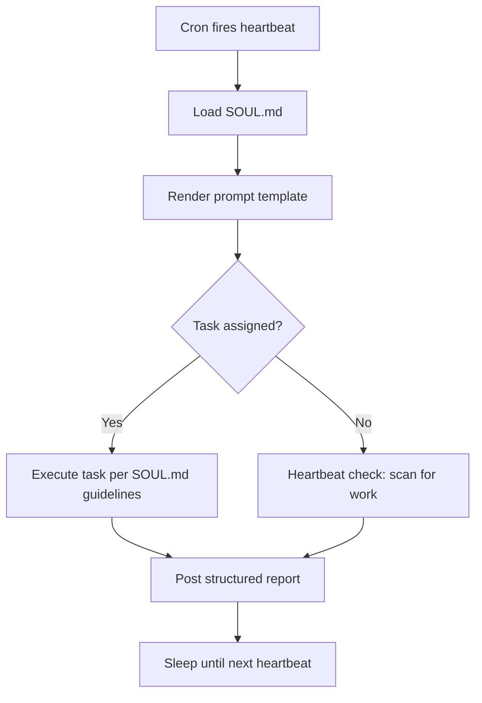

# Agent Configuration

How to configure Paperclip agents with SOUL.md personality files, prompt templates, and the "Memento Man" pattern.

## Overview

Each agent in the Lecture AI Operations Center has three configuration layers:

1. **company.json** — org chart, adapter config, budget, heartbeat schedule
2. **SOUL.md** — personality file defining lane, capabilities, constraints, and reporting format
3. **Prompt template** — Mustache template injected on every heartbeat with task context

## The Memento Man Pattern

Agents have no persistent memory of who they are between heartbeats. Like the protagonist of Memento, they wake up every cycle with no context. The solution: tattoo instructions onto their body.

On every heartbeat:
1. The scheduler fires the agent's cron (`heartbeatSchedule` in company.json)
2. The adapter reads the agent's `soulMdPath` and `promptTemplatePath`
3. The prompt template is rendered with current context (task, agent metadata)
4. The SOUL.md content is prepended to the system prompt
5. The agent executes with full awareness of who it is, what it does, and what it never does
6. Results are posted as structured comments following the reporting format



## File Structure

```
hermes/agents/
  ai-ops-director/
    SOUL.md                          # CEO personality and lane
  assessment-quality/
    SOUL.md                          # Assessment specialist personality
  curriculum-compliance/
    SOUL.md                          # Compliance specialist personality
  knowledge-curator/
    SOUL.md                          # Knowledge specialist personality
  prompt-templates/
    heartbeat-ceo.md                 # Template for the CEO agent
    heartbeat-specialist.md          # Template for all specialist agents

paperclip/company-templates/higher-ed/
  company.json                       # Org chart with soulMdPath references
```

## SOUL.md Anatomy

Every SOUL.md file follows the same structure:

| Section | Purpose |
|---------|---------|
| **Identity** | Who the agent is, one paragraph |
| **Your Lane** | What the agent is responsible for |
| **You Never** | Hard constraints the agent must not violate |
| **Definition of Done** | Checklist for when a task is complete |
| **Reporting Format** | Structured output format for comments |

Additional sections vary by agent (e.g., Tools & Integration, Knowledge Graph Schema).

## Prompt Templates

Templates use Mustache syntax with these variables:

| Variable | Description |
|----------|-------------|
| `{{ agent.name }}` | Agent display name |
| `{{ agent.role }}` | Role in org chart (CEO, Engineer) |
| `{{ agent.title }}` | Full title |
| `{{ agent.reportsTo }}` | Manager agent name |
| `{{#taskId}}...{{/taskId}}` | Block rendered when a task is assigned |
| `{{#noTask}}...{{/noTask}}` | Block rendered during idle heartbeats |
| `{{ task.title }}` | Current task title |
| `{{ task.body }}` | Current task body/description |

Two templates exist:
- **heartbeat-ceo.md** — for the AI Operations Director (coordinates team)
- **heartbeat-specialist.md** — for all specialist agents (execute and report)

## company.json Agent Fields

Each agent entry in company.json includes:

| Field | Description |
|-------|-------------|
| `soulMdPath` | Relative path to the agent's SOUL.md file |
| `promptTemplatePath` | Relative path to the agent's prompt template |
| `capabilities` | Plain-text summary for the org chart UI |
| `heartbeatSchedule` | Cron expression for when the agent wakes up |
| `monthlyBudgetCents` | Spending cap in cents per month |
| `reportsTo` | Manager agent name (omitted for CEO) |

## Adding a New Agent

1. Create a directory under `hermes/agents/<agent-slug>/`
2. Write a `SOUL.md` following the anatomy above
3. Choose or create a prompt template in `hermes/agents/prompt-templates/`
4. Add an entry to `company.json` with `soulMdPath` and `promptTemplatePath`
5. Set the heartbeat schedule and budget
6. Deploy — the agent will wake up on its next cron tick
