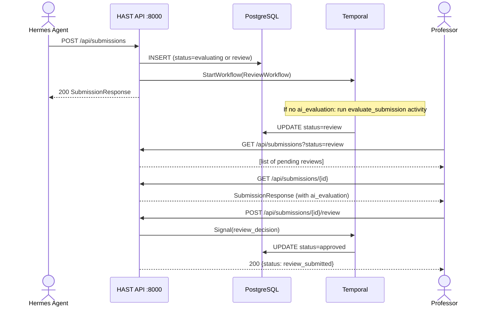

# HAST API Reference

The HAST (Human-in-the-loop Assessment and Submission Tracker) API is a FastAPI service that manages submissions and their review workflows.

**Base URL:** `http://localhost:8000`

## Endpoints Overview

| Method | Path | Description |
|--------|------|-------------|
| `GET` | `/health` | Health check |
| `POST` | `/api/submissions` | Create a submission and start review workflow |
| `GET` | `/api/submissions` | List submissions (with optional status filter) |
| `GET` | `/api/submissions/{id}` | Get a single submission |
| `POST` | `/api/submissions/{id}/review` | Submit a human review decision |

## End-to-End Flow



---

## GET /health

Health check endpoint.

**Response:**

```json
{"status": "ok", "service": "hast-review"}
```

**Example:**

```bash
curl http://localhost:8000/health
```

---

## POST /api/submissions

Create a new submission and start a Temporal ReviewWorkflow.

**Request Body** (`SubmissionCreate`):

| Field | Type | Required | Description |
|-------|------|----------|-------------|
| `submission_type` | string | yes | `assessment`, `enrollment`, or `compliance` |
| `entity_id` | string | yes | Student, course, or applicant ID |
| `content` | string | yes | The content being evaluated |
| `criteria` | string | no | Evaluation rubric or criteria text |
| `context` | object | no | Metadata (course_id, program_id, etc.) |
| `ai_evaluation` | object | no | Pre-computed AI evaluation. If provided, workflow skips to `review` status. |
| `paperclip_run_id` | string | no | Paperclip run ID for traceability |

**Response** (`SubmissionResponse`, 200):

```json
{
  "id": "a1b2c3d4-...",
  "submission_type": "assessment",
  "entity_id": "student-42",
  "status": "review",
  "content": "The student's essay text...",
  "ai_evaluation": {
    "overall_score": 78,
    "criterion_scores": [...],
    "strengths": ["..."],
    "weaknesses": ["..."]
  },
  "review_decision": null,
  "reviewer_notes": null,
  "created_at": "2026-03-31T10:00:00",
  "updated_at": "2026-03-31T10:00:00",
  "workflow_id": "review-a1b2c3d4-..."
}
```

**Example:**

```bash
curl -X POST http://localhost:8000/api/submissions \
  -H "Content-Type: application/json" \
  -d '{
    "submission_type": "assessment",
    "entity_id": "student-42",
    "content": "Essay on machine learning ethics...",
    "criteria": "Clarity: 30%, Argument: 40%, Sources: 30%",
    "context": {"course_id": "CS101", "assignment": "midterm"},
    "ai_evaluation": {
      "overall_score": 78,
      "criterion_scores": [
        {"criterion": "Clarity", "score": 82, "weight": 0.3, "feedback": "Well structured"},
        {"criterion": "Argument", "score": 75, "weight": 0.4, "feedback": "Needs more depth"},
        {"criterion": "Sources", "score": 80, "weight": 0.3, "feedback": "Good variety"}
      ],
      "strengths": ["Clear writing", "Good source variety"],
      "weaknesses": ["Argument lacks depth in section 3"],
      "improvement_suggestions": ["Expand the ethical implications section"]
    }
  }'
```

---

## GET /api/submissions

List submissions, optionally filtered by status.

**Query Parameters:**

| Parameter | Type | Default | Description |
|-----------|------|---------|-------------|
| `status` | string | -- | Filter by status (`pending`, `evaluating`, `review`, `approved`, `rejected`, `revision_requested`, `expired`) |
| `limit` | int | 50 | Maximum number of results |

**Response** (array of `SubmissionResponse`):

```json
[
  {
    "id": "a1b2c3d4-...",
    "submission_type": "assessment",
    "entity_id": "student-42",
    "status": "review",
    ...
  }
]
```

**Examples:**

```bash
# All submissions
curl http://localhost:8000/api/submissions

# Only pending reviews
curl "http://localhost:8000/api/submissions?status=review"

# Last 10
curl "http://localhost:8000/api/submissions?limit=10"
```

---

## GET /api/submissions/{submission_id}

Get a single submission by ID.

**Path Parameters:**

| Parameter | Type | Description |
|-----------|------|-------------|
| `submission_id` | string (UUID) | The submission ID |

**Response** (`SubmissionResponse`, 200) or `404` if not found.

**Example:**

```bash
curl http://localhost:8000/api/submissions/a1b2c3d4-5678-9abc-def0-123456789abc
```

---

## POST /api/submissions/{submission_id}/review

Submit a human review decision. Sends a signal to the running Temporal workflow.

**Prerequisite:** The submission must be in `review` status.

**Request Body** (`ReviewDecision`):

| Field | Type | Required | Description |
|-------|------|----------|-------------|
| `decision` | string | yes | `approved`, `rejected`, or `revision_requested` |
| `reviewer_notes` | string | no | Free-text notes from the reviewer |
| `adjusted_score` | float | no | Override the AI-generated score |
| `adjusted_evaluation` | object | no | Override specific evaluation fields |

**Response** (200):

```json
{
  "status": "review_submitted",
  "submission_id": "a1b2c3d4-..."
}
```

**Error** (400) -- submission not in `review` status:

```json
{
  "detail": "Submission is in 'approved' status, not 'review'"
}
```

**Example:**

```bash
# Approve
curl -X POST http://localhost:8000/api/submissions/a1b2c3d4-.../review \
  -H "Content-Type: application/json" \
  -d '{
    "decision": "approved",
    "reviewer_notes": "Good evaluation. Score is fair."
  }'

# Reject with adjusted score
curl -X POST http://localhost:8000/api/submissions/a1b2c3d4-.../review \
  -H "Content-Type: application/json" \
  -d '{
    "decision": "rejected",
    "reviewer_notes": "AI overrated the argument quality.",
    "adjusted_score": 62.0
  }'

# Request revision
curl -X POST http://localhost:8000/api/submissions/a1b2c3d4-.../review \
  -H "Content-Type: application/json" \
  -d '{
    "decision": "revision_requested",
    "reviewer_notes": "Student needs to resubmit section 3."
  }'
```

---

## Error Codes

| HTTP Status | Meaning | When |
|-------------|---------|------|
| 200 | Success | Request processed |
| 400 | Bad Request | Submission not in expected status, or invalid payload |
| 404 | Not Found | Submission ID does not exist |
| 422 | Validation Error | Request body fails Pydantic validation |
| 500 | Internal Server Error | Database or Temporal connection failure |

---

## Pydantic Model Schemas

### SubmissionCreate

```python
class SubmissionCreate(BaseModel):
    submission_type: str        # "assessment" | "enrollment" | "compliance"
    entity_id: str              # Student/course/applicant ID
    context: dict[str, Any]     # Metadata (default: {})
    content: str                # The content being evaluated
    criteria: str               # Evaluation rubric (default: "")
    ai_evaluation: dict | None  # Pre-computed AI evaluation (default: None)
    paperclip_run_id: str | None  # Traceability link (default: None)
```

### ReviewDecision

```python
class ReviewDecision(BaseModel):
    decision: str                       # "approved" | "rejected" | "revision_requested"
    reviewer_notes: str                 # Free-text (default: "")
    adjusted_score: float | None        # Override score (default: None)
    adjusted_evaluation: dict | None    # Override eval fields (default: None)
```

### SubmissionResponse

```python
class SubmissionResponse(BaseModel):
    id: str
    submission_type: str
    entity_id: str
    status: SubmissionStatus      # Enum: pending, evaluating, review, approved,
                                  #        rejected, revision_requested, expired
    content: str
    ai_evaluation: dict | None
    review_decision: str | None
    reviewer_notes: str | None
    created_at: datetime
    updated_at: datetime
    workflow_id: str | None
```

### SubmissionStatus (Enum)

```python
class SubmissionStatus(str, Enum):
    PENDING = "pending"
    EVALUATING = "evaluating"
    REVIEW = "review"
    APPROVED = "approved"
    REJECTED = "rejected"
    REVISION_REQUESTED = "revision_requested"
    EXPIRED = "expired"
```
