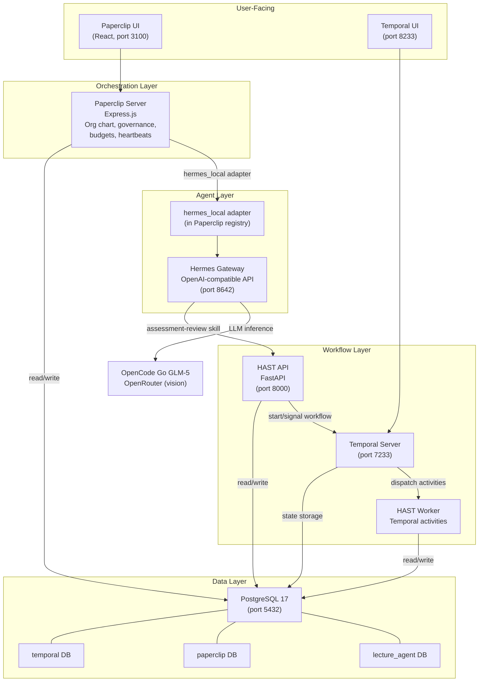
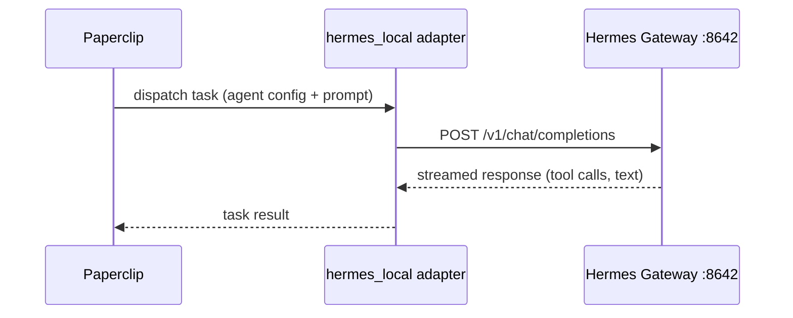
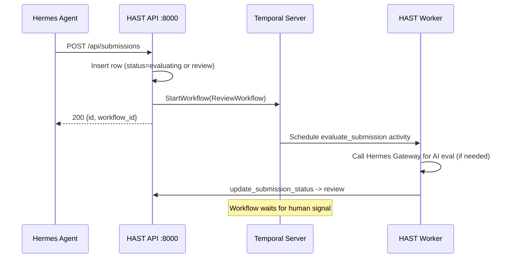
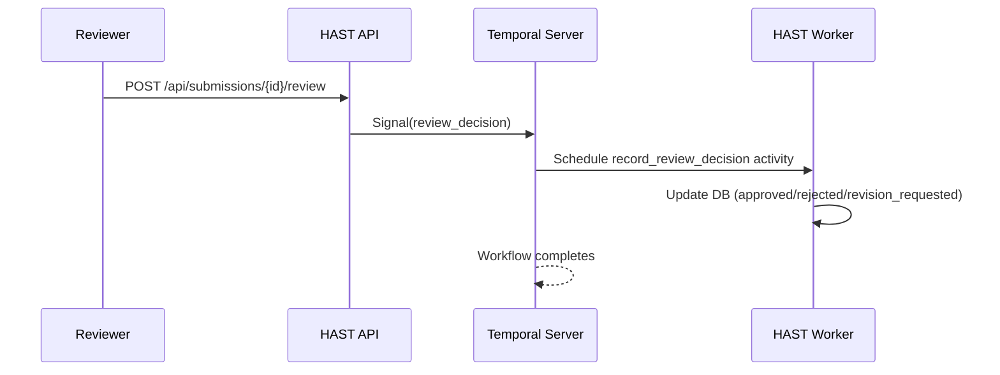
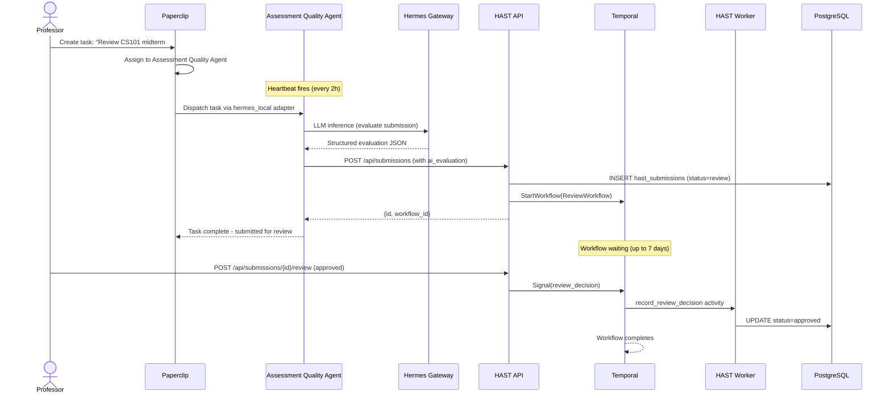
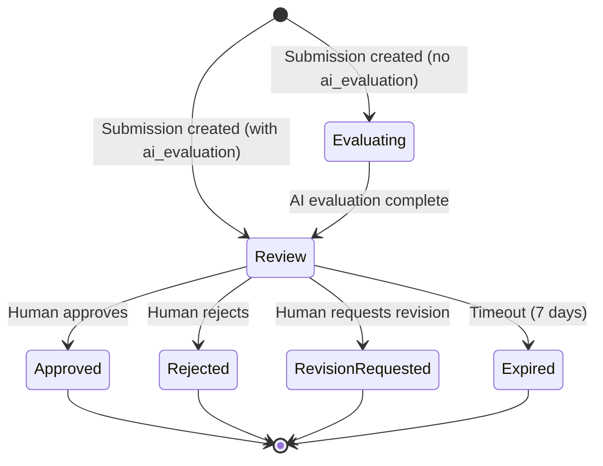

# Lecture Agentic AI — Architecture

> Part of [EDT&Partners' Lecture platform](https://www.edtpartners.com/lecture) — extending Lecture with autonomous multi-agent capabilities.

## System Overview

Lecture Agentic AI is the agentic AI layer for EDT&Partners' [Lecture](https://www.edtpartners.com/lecture) platform. While Lecture provides GenAI capabilities like Content Chat, Questions Generator, and Evaluations & Rubrics, this component adds autonomous multi-agent orchestration — enabling AI agents to work independently on institutional tasks with human-in-the-loop governance.

Built on three open-source pillars (Paperclip, Hermes, Temporal) plus custom domain logic (HAST, education skills, company templates), the system runs as seven Docker Compose services backed by a single PostgreSQL instance hosting three databases.

## Communication Patterns

### Paperclip to Hermes (Task Dispatch)

Paperclip manages an org chart of AI agents. Each agent has an `adapterType: hermes_local` entry that maps it to the built-in Hermes adapter in Paperclip's registry. When a task is assigned and a heartbeat fires, Paperclip calls Hermes Gateway's OpenAI-compatible chat completions endpoint with the agent's configured model, toolsets, and the task prompt.

### Hermes Skill to HAST API (Submission)

When an agent uses the `assessment-review` skill, the skill instructions tell the agent to POST to the HAST API. This triggers a Temporal workflow.

### HAST API to Temporal (Signal Flow)

Human review decisions arrive via REST and are forwarded as Temporal signals.

## Assessment Review Data Flow

End-to-end flow from professor request to final decision:

## ReviewWorkflow States

## Technology Rationale

| Component | Technology | Why |
|-----------|-----------|-----|
| Orchestration | Paperclip (Node.js/React) | Multi-agent governance out of the box -- org charts, budgets, heartbeats, task tracking. Already has a `hermes_local` adapter in its registry. |
| Agent Runtime | Hermes (Python) | Persistent memory, tool use, skill system via SKILL.md files. OpenAI-compatible gateway simplifies integration. |
| Workflow Engine | Temporal | Durable execution survives crashes. Built-in signal/query support maps naturally to human-in-the-loop approval. Timeout handling is declarative. |
| API Layer | FastAPI | Async Python, automatic OpenAPI docs, Pydantic validation. Matches Temporal's Python SDK. |
| Database | PostgreSQL 17 | Single instance, three databases. Temporal requires Postgres. Paperclip requires Postgres. HAST needs relational storage for submissions. |
| LLM Provider | OpenCode Go (GLM-5) | Cost-effective text model for education domain. Vision via OpenRouter Gemini Flash Lite for multimodal tasks. |

## Security Model

**Current state (PoC):**

- **Network isolation**: All services communicate over a Docker Compose internal network. Only mapped ports are exposed to the host.
- **API key gating**: Hermes Gateway requires `API_SERVER_KEY` for all requests. HAST and Paperclip pass the key via `HERMES_API_KEY`.
- **Auth on Paperclip**: Paperclip runs in `authenticated` mode with `BETTER_AUTH_SECRET` for session signing. Exposure is set to `private`.
- **CORS**: HAST API currently allows all origins (`*`) -- acceptable for local PoC, must be locked down for production.
- **Secrets**: All API keys and passwords are passed via environment variables (`.env` file, not committed).
- **Database**: Single shared PostgreSQL user for simplicity. Production should use per-database roles with least-privilege grants.

**Production hardening checklist:**

1. Replace CORS `*` with explicit allowed origins
2. Add API key authentication to HAST API endpoints
3. Create separate PostgreSQL roles per database
4. Put a reverse proxy (Caddy) in front with TLS termination
5. Enable Temporal's mTLS for server-worker communication
6. Rotate `BETTER_AUTH_SECRET` and `HERMES_API_KEY` regularly
7. Run containers as non-root users
