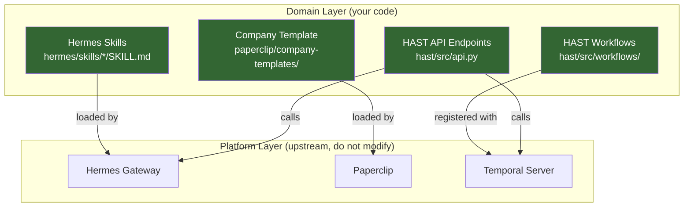

# Customization Guide

This guide covers the main extension points in Lecture Agent. The system is designed so that you configure rather than fork the upstream components (Paperclip, Hermes, Temporal).

## Extension Points Overview



---

## Adding New Hermes Skills

Skills are defined as `SKILL.md` files. Hermes loads them from the `hermes/skills/` directory.

### 1. Create the skill directory

```bash
mkdir hermes/skills/my-new-skill
```

### 2. Write SKILL.md

```markdown
---
name: my-new-skill
description: >
  Brief description of what this skill does.
version: 1.0.0
author: Your Name
metadata:
  hermes:
    tags: [Education, YourDomain]
triggers:
  - phrase that activates this skill
  - another trigger phrase
tools_required:
  - web
  - file
  - terminal
---

# My New Skill

## Purpose
Describe the agent's role when using this skill.

## Workflow
1. Step one
2. Step two
3. Step three

## Integration Notes
- API endpoints the skill calls
- Expected response formats
```

### 3. Key SKILL.md fields

| Field | Purpose |
|-------|---------|
| `name` | Unique skill identifier |
| `description` | Shown to the agent for skill selection |
| `triggers` | Natural language phrases that activate the skill |
| `tools_required` | Hermes toolsets needed (`web`, `file`, `terminal`, `memory`) |
| `metadata.hermes.tags` | Categorization for skill discovery |

### 4. Reference existing skills

See these working examples:

- `hermes/skills/assessment-review/SKILL.md` -- evaluates student submissions, calls HAST API
- `hermes/skills/curriculum-compliance/SKILL.md` -- reviews syllabi against accreditation standards
- `hermes/skills/enrollment-evaluation/SKILL.md` -- evaluates enrollment applications
- `hermes/skills/knowledge-augmentation/SKILL.md` -- maintains knowledge graph

---

## Adding New Agents to the Org Chart

Agents are defined in the company template JSON file.

### 1. Edit the company template

Open `paperclip/company-templates/higher-ed/company.json` and add an entry to the `agents` array:

```json
{
  "name": "Student Success Agent",
  "role": "Engineer",
  "title": "Student Success Specialist",
  "adapterType": "hermes_local",
  "adapterConfig": {
    "model": "glm-5",
    "provider": "opencode-go",
    "maxIterations": 30,
    "timeoutSec": 300,
    "persistSession": true,
    "enabledToolsets": ["terminal", "file", "web", "memory"]
  },
  "capabilities": "Monitors student engagement. Identifies at-risk students. Recommends interventions. Uses the student-success skill.",
  "monthlyBudgetCents": 2000,
  "heartbeatSchedule": "0 */6 * * *",
  "reportsTo": "AI Operations Director"
}
```

### 2. Key agent fields

| Field | Purpose |
|-------|---------|
| `name` | Display name in the org chart |
| `role` | Paperclip role: `CEO`, `Engineer`, `Manager` |
| `adapterType` | Always `hermes_local` for Hermes agents |
| `adapterConfig.model` | LLM model name (must match `hermes/config.yaml`) |
| `adapterConfig.maxIterations` | Max tool-use turns per task |
| `adapterConfig.timeoutSec` | Task timeout in seconds |
| `adapterConfig.enabledToolsets` | Which Hermes tools the agent can use |
| `capabilities` | Natural language description of what the agent does |
| `monthlyBudgetCents` | Spending cap in cents per month |
| `heartbeatSchedule` | Cron expression for when the agent wakes up |
| `reportsTo` | Name of the manager agent |

### 3. Reload

Restart the Paperclip container to pick up the new agent:

```bash
docker compose restart paperclip
```

---

## Modifying the Company Template

The company template defines the entire org structure. You can:

- **Change the company name and goal** -- edit the top-level `name` and `goal` fields
- **Restructure the hierarchy** -- change `reportsTo` links and `role` values
- **Adjust budgets** -- modify `monthlyBudgetCents` per agent
- **Change heartbeat frequency** -- modify `heartbeatSchedule` cron expressions

### Creating a new template

```bash
mkdir paperclip/company-templates/my-institution
cp paperclip/company-templates/higher-ed/company.json \
   paperclip/company-templates/my-institution/company.json
# Edit the new file
```

To use the new template, configure Paperclip to load it (refer to Paperclip documentation for template selection).

---

## Changing LLM Provider

### Text model

1. Edit `hermes/config.yaml`:

```yaml
model:
  provider: openrouter        # or openai, anthropic, etc.
  default: gpt-4o             # model name
  base_url: https://openrouter.ai/api/v1
```

2. Update agent configs in `company.json`:

```json
"adapterConfig": {
  "model": "gpt-4o",
  "provider": "openrouter",
  ...
}
```

3. Set the appropriate API key in `.env`:

```dotenv
OPENROUTER_API_KEY=sk-or-v1-...
```

### Vision model

Edit `hermes/config.yaml`:

```yaml
vision:
  provider: openrouter
  model: google/gemini-3.1-flash-lite-preview
```

### Supported providers

Hermes supports any OpenAI-compatible API. Common options:

| Provider | `provider` value | Base URL |
|----------|-----------------|----------|
| OpenCode Go | `opencode-go` | `https://opencode.ai/zen/go/v1` |
| OpenRouter | `openrouter` | `https://openrouter.ai/api/v1` |
| OpenAI | `openai` | `https://api.openai.com/v1` |
| Local (Ollama) | `openai` | `http://localhost:11434/v1` |

---

## Adding New HAST Workflow Types

See the [Workflows Guide](WORKFLOWS.md#building-custom-workflows) for step-by-step instructions. Summary:

1. Create a new workflow class in `hast/src/workflows/`
2. Define activity functions
3. Register both in `hast/src/worker.py`
4. Add API endpoints in `hast/src/api.py`
5. Create a corresponding Hermes skill

### Example workflow types for education:

- **Enrollment Approval** -- AI screens applications, admissions officer reviews
- **Compliance Audit** -- AI checks syllabus against standards, compliance officer reviews
- **Grade Appeal** -- student appeals, AI gathers context, department chair reviews
- **Research Ethics** -- AI pre-screens proposals, ethics board reviews

---

## Adding New API Endpoints

### 1. Add Pydantic models

In `hast/src/models.py`:

```python
class MyNewRequest(BaseModel):
    field_one: str
    field_two: int = 0

class MyNewResponse(BaseModel):
    id: str
    result: dict
```

### 2. Add the endpoint

In `hast/src/api.py`:

```python
@app.post("/api/my-endpoint", response_model=MyNewResponse)
async def my_endpoint(payload: MyNewRequest):
    # Your logic here
    return MyNewResponse(id="...", result={})
```

### 3. Add database table (if needed)

Add a migration SQL file to `infra/postgres/` and reference it in `docker-compose.yml`:

```yaml
volumes:
  - ./infra/postgres/init-my-table.sql:/docker-entrypoint-initdb.d/02-init-my-table.sql
```

Note: Init scripts only run on first database creation. For existing deployments, run the SQL manually:

```bash
docker compose exec postgres psql -U lecture -d lecture_agent -f /path/to/migration.sql
```

### 4. Rebuild

```bash
docker compose up --build hast-api hast-worker
```
