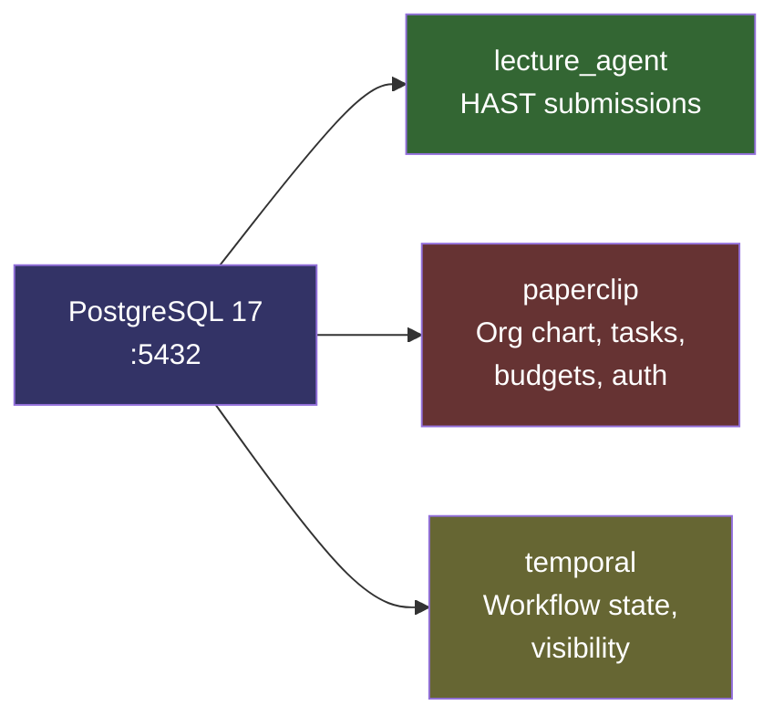
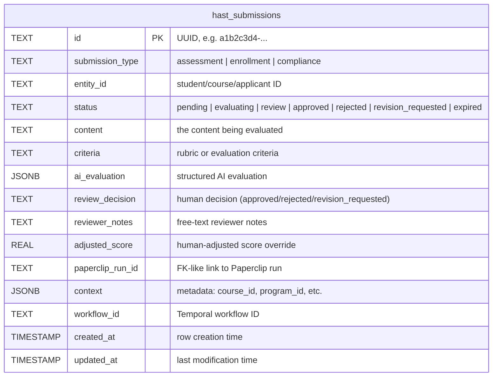
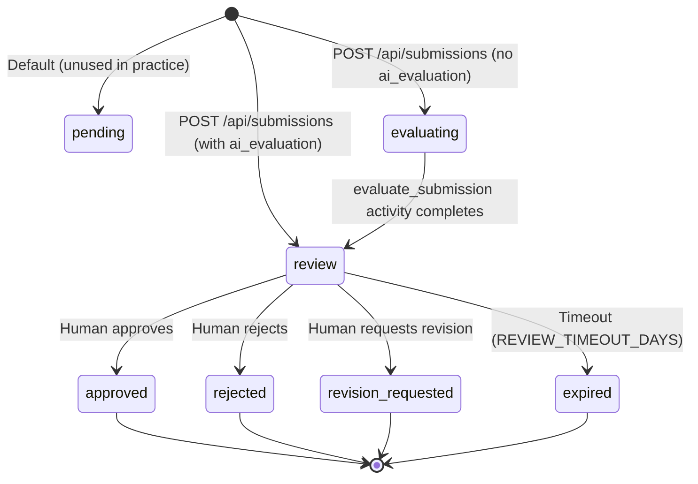

# Data Model

## Database Overview

Lecture Agent uses a single PostgreSQL 17 instance hosting three databases:



| Database | Owner | Purpose |
|----------|-------|---------|
| `lecture_agent` | HAST | Submission records, AI evaluations, review decisions. Created as `POSTGRES_DB` (default database). |
| `paperclip` | Paperclip | Org chart, agents, tasks, runs, auth sessions. Managed by Paperclip's ORM (auto-migrated). |
| `temporal` + `temporal_visibility` | Temporal Server | Workflow execution history, timer state, search attributes. Managed by Temporal's auto-setup. |

Only `lecture_agent` has manually managed schema (via `init-db.sql`). Paperclip and Temporal manage their own schemas automatically.

---

## hast_submissions Table

### ER Diagram



### Column Descriptions

| Column | Type | Nullable | Default | Description |
|--------|------|----------|---------|-------------|
| `id` | `TEXT` | no | -- | Primary key. UUID v4 generated by the API. |
| `submission_type` | `TEXT` | no | -- | Category: `assessment`, `enrollment`, or `compliance`. |
| `entity_id` | `TEXT` | no | -- | Identifier for the entity being evaluated (student ID, course ID, applicant ID). |
| `status` | `TEXT` | no | `'pending'` | Current workflow state. See status enum below. |
| `content` | `TEXT` | no | -- | The raw content submitted for evaluation (essay text, syllabus, application). |
| `criteria` | `TEXT` | yes | `''` | Evaluation rubric or criteria provided by the professor. |
| `ai_evaluation` | `JSONB` | yes | -- | Structured AI evaluation output: scores, strengths, weaknesses, feedback. |
| `review_decision` | `TEXT` | yes | -- | Human reviewer's final decision. Set by the `record_review_decision` activity. |
| `reviewer_notes` | `TEXT` | yes | -- | Free-text notes from the human reviewer. |
| `adjusted_score` | `REAL` | yes | -- | Human-adjusted score if the reviewer overrides the AI score. |
| `paperclip_run_id` | `TEXT` | yes | -- | Links back to the Paperclip task run that created this submission. |
| `context` | `JSONB` | yes | `'{}'` | Arbitrary metadata: `{"course_id": "CS101", "semester": "2026-spring"}`. |
| `workflow_id` | `TEXT` | yes | -- | Temporal workflow ID (`review-{submission_id}`). Used to send signals. |
| `created_at` | `TIMESTAMP` | no | `NOW()` | When the submission was created. |
| `updated_at` | `TIMESTAMP` | no | `NOW()` | When the submission was last modified. |

### SQL Schema

```sql
CREATE TABLE IF NOT EXISTS hast_submissions (
    id              TEXT PRIMARY KEY,
    submission_type TEXT NOT NULL,
    entity_id       TEXT NOT NULL,
    status          TEXT NOT NULL DEFAULT 'pending',
    content         TEXT NOT NULL,
    criteria        TEXT DEFAULT '',
    ai_evaluation   JSONB,
    review_decision TEXT,
    reviewer_notes  TEXT,
    adjusted_score  REAL,
    paperclip_run_id TEXT,
    context         JSONB DEFAULT '{}',
    workflow_id     TEXT,
    created_at      TIMESTAMP NOT NULL DEFAULT NOW(),
    updated_at      TIMESTAMP NOT NULL DEFAULT NOW()
);
```

---

## Status Enum



| Status | Value | Meaning |
|--------|-------|---------|
| `pending` | `"pending"` | Default DB value. Not used by the API in practice (immediately set to `evaluating` or `review`). |
| `evaluating` | `"evaluating"` | AI evaluation is in progress via Temporal activity. |
| `review` | `"review"` | AI evaluation complete. Waiting for human reviewer. |
| `approved` | `"approved"` | Human approved the submission/evaluation. Terminal state. |
| `rejected` | `"rejected"` | Human rejected the submission/evaluation. Terminal state. |
| `revision_requested` | `"revision_requested"` | Human requested changes. Terminal state. |
| `expired` | `"expired"` | No human review within timeout period. Terminal state. |

---

## Index Strategy

Three indexes are defined for common query patterns:

```sql
CREATE INDEX IF NOT EXISTS idx_submissions_status ON hast_submissions(status);
CREATE INDEX IF NOT EXISTS idx_submissions_type   ON hast_submissions(submission_type);
CREATE INDEX IF NOT EXISTS idx_submissions_entity ON hast_submissions(entity_id);
```

| Index | Column | Purpose |
|-------|--------|---------|
| `idx_submissions_status` | `status` | Filter by status (the most common query: "show all pending reviews"). |
| `idx_submissions_type` | `submission_type` | Filter by submission category. |
| `idx_submissions_entity` | `entity_id` | Look up all submissions for a specific student or course. |

For production scale, consider adding:

- Composite index `(status, created_at DESC)` for the paginated listing query
- GIN index on `ai_evaluation` if you need to query inside the JSONB
- Partial index `WHERE status = 'review'` for the reviewer dashboard

---

## Example Queries

```sql
-- All submissions awaiting review, newest first
SELECT id, entity_id, submission_type, created_at
FROM hast_submissions
WHERE status = 'review'
ORDER BY created_at DESC;

-- Submissions for a specific student
SELECT id, submission_type, status, ai_evaluation->>'overall_score' AS score
FROM hast_submissions
WHERE entity_id = 'student-42';

-- Average AI score by submission type
SELECT submission_type,
       AVG((ai_evaluation->>'overall_score')::float) AS avg_score,
       COUNT(*) AS total
FROM hast_submissions
WHERE ai_evaluation IS NOT NULL
GROUP BY submission_type;

-- Submissions that expired without review
SELECT id, entity_id, created_at, updated_at
FROM hast_submissions
WHERE status = 'expired'
ORDER BY updated_at DESC;

-- Time from creation to review decision
SELECT id,
       review_decision,
       updated_at - created_at AS review_duration
FROM hast_submissions
WHERE review_decision IS NOT NULL
ORDER BY review_duration DESC;
```
