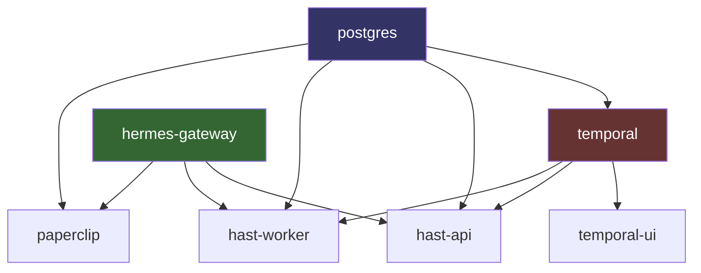
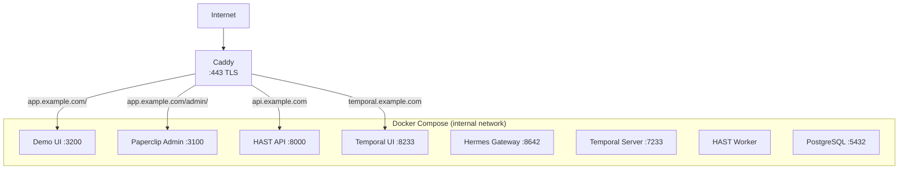

# Deployment Guide

## Prerequisites

- **Docker** >= 24.0 and **Docker Compose** v2
- **Git**
- API keys for:
  - OpenCode Go (`OPENCODE_GO_API_KEY`)
  - OpenRouter (`OPENROUTER_API_KEY`)

For production:
- A VPS (Hetzner CPX31 or equivalent: 4 vCPU, 8 GB RAM, 160 GB SSD)
- A domain name with DNS pointed at the VPS
- Caddy (auto-TLS reverse proxy)

## Local Development Setup

### Step 1: Clone and configure

```bash
git clone <repo-url>
cd lecture-agentic-ai
cp .env.example .env
```

Edit `.env` and fill in your API keys:

```dotenv
OPENCODE_GO_API_KEY=sk-your-key
OPENROUTER_API_KEY=sk-or-v1-your-key
HERMES_API_KEY=edu-platform-test-key-2026
POSTGRES_USER=lecture
POSTGRES_PASSWORD=lecture_dev
BETTER_AUTH_SECRET=change-me-to-a-random-32-char-string
PAPERCLIP_PUBLIC_URL=http://localhost:3100
```

### Step 2: Start all services

```bash
docker compose up --build
```

First run takes 3-5 minutes (image pulls + builds). Subsequent starts are under 30 seconds.

### Step 3: Verify

| Check | Command / URL |
|-------|---------------|
| Paperclip UI | http://localhost:3100 |
| HAST health | `curl http://localhost:8000/health` |
| Temporal UI | http://localhost:8233 |
| Hermes Gateway | `curl http://localhost:8642/health` |
| PostgreSQL | `docker compose exec postgres psql -U lecture -d lecture_agent -c '\dt'` |

### Step 4: Stop

```bash
docker compose down          # Stop containers, keep data
docker compose down -v       # Stop containers AND delete volumes (full reset)
```

## Docker Compose Configuration

The `docker-compose.yml` defines seven services with explicit dependency ordering:



Arrows show `depends_on` relationships. PostgreSQL must be healthy before Temporal or any application service starts. Hermes Gateway must be started before HAST and Paperclip.

### Volumes

| Volume | Purpose |
|--------|---------|
| `postgres_data` | PostgreSQL data directory |
| `hermes_data` | Hermes agent memory and session state |
| `paperclip_data` | Paperclip persistent storage |

### Init scripts

Two scripts run on first PostgreSQL start (via `/docker-entrypoint-initdb.d/`):

1. `init-multi-db.sh` -- creates `paperclip`, `temporal`, and `temporal_visibility` databases
2. `init-hast.sql` -- creates the `hast_submissions` table and indexes in `lecture_agent`

## Environment Variables Reference

| Variable | Service(s) | Default | Description |
|----------|-----------|---------|-------------|
| `OPENCODE_GO_API_KEY` | hermes-gateway, paperclip | -- | API key for OpenCode Go LLM provider |
| `OPENROUTER_API_KEY` | hermes-gateway, paperclip | -- | API key for OpenRouter (vision model) |
| `HERMES_API_KEY` | hermes-gateway, hast-api, hast-worker, paperclip | `edu-platform-test-key-2026` | Shared key for Hermes Gateway auth |
| `POSTGRES_USER` | postgres, all services | `lecture` | PostgreSQL superuser name |
| `POSTGRES_PASSWORD` | postgres, all services | `lecture_dev` | PostgreSQL password |
| `BETTER_AUTH_SECRET` | paperclip | `lecture-agentic-ai-dev-secret-32chars-min` | Session signing secret (min 32 chars) |
| `PAPERCLIP_PUBLIC_URL` | paperclip | `http://localhost:3100` | Public URL for Paperclip (used in auth callbacks) |
| `DATABASE_URL` | hast-api, hast-worker | (constructed from PG vars) | Full PostgreSQL connection string |
| `TEMPORAL_ADDRESS` | hast-api, hast-worker | `temporal:7233` | Temporal server gRPC address |
| `TEMPORAL_TASK_QUEUE` | hast-worker | `lecture-review-queue` | Temporal task queue name |
| `HERMES_GATEWAY_URL` | hast-api, hast-worker | `http://hermes-gateway:8642` | Hermes Gateway URL for AI evaluation |
| `REVIEW_TIMEOUT_DAYS` | hast-worker | `7` | Days before unreviewed submissions expire |
| `HAST_API_KEY` | hast-api, hast-worker | (falls back to `HERMES_API_KEY`) | Bearer token for HAST API authentication |
| `CORS_ALLOWED_ORIGINS` | hast-api | `http://localhost:3100,...` | Comma-separated allowed CORS origins |
| `NOTIFICATION_WEBHOOK_URL` | hast-api, hast-worker | (empty) | Webhook URL for review notifications (optional) |

## Production Deployment (Hetzner / VPS)

### Architecture



### Step 1: Provision the VPS

```bash
# On Hetzner Cloud, create a CPX31 (4 vCPU, 8 GB, 160 GB SSD)
# Choose Ubuntu 24.04 LTS
# Add your SSH key
```

### Step 2: Install Docker

```bash
ssh root@your-server
curl -fsSL https://get.docker.com | sh
systemctl enable docker
```

### Step 3: Clone and configure

```bash
git clone <repo-url> /opt/lecture-agentic-ai
cd /opt/lecture-agentic-ai
cp .env.example .env
# Edit .env with production values:
#   - Strong POSTGRES_PASSWORD
#   - Strong BETTER_AUTH_SECRET (32+ random chars)
#   - Real API keys
#   - PAPERCLIP_PUBLIC_URL=https://app.example.com
```

### Step 4: Lock down ports

Edit `docker-compose.yml` to bind services to `127.0.0.1` only:

```yaml
ports:
  - "127.0.0.1:3100:3100"   # Paperclip
  - "127.0.0.1:8000:8000"   # HAST API
  - "127.0.0.1:8233:8080"   # Temporal UI
  # Remove public exposure for:
  # - PostgreSQL (5432)
  # - Temporal gRPC (7233)
  # - Hermes Gateway (8642)
```

### Step 5: Install and configure Caddy

```bash
apt install -y caddy
```

Create `/etc/caddy/Caddyfile`:

```caddyfile
app.example.com {
    reverse_proxy localhost:3100
}

api.example.com {
    reverse_proxy localhost:8000
}

temporal.example.com {
    reverse_proxy localhost:8233
    basicauth {
        admin $2a$14$... # generate with: caddy hash-password
    }
}
```

```bash
systemctl reload caddy
```

Caddy automatically provisions TLS certificates via Let's Encrypt.

### Step 6: Start services

```bash
cd /opt/lecture-agentic-ai
docker compose up -d --build
```

### Step 7: Verify

```bash
curl https://api.example.com/health
curl https://app.example.com
```

## Database Management

### Initialize (first run)

Databases are created automatically by the init scripts when the PostgreSQL container starts for the first time.

### Reset (development)

```bash
# Full reset: drop all data and recreate
docker compose down -v
docker compose up --build
```

### Reset HAST table only

```bash
docker compose exec postgres psql -U lecture -d lecture_agent \
  -c "TRUNCATE hast_submissions;"
```

### Backup

```bash
# Backup all databases
docker compose exec postgres pg_dumpall -U lecture > backup_$(date +%Y%m%d).sql

# Backup lecture_agent only
docker compose exec postgres pg_dump -U lecture lecture_agent > hast_backup.sql
```

### Restore

```bash
cat backup.sql | docker compose exec -T postgres psql -U lecture
```

## Monitoring and Logs

### View logs

```bash
docker compose logs -f                    # All services
docker compose logs -f hast-api           # Single service
docker compose logs --since 1h paperclip  # Last hour
```

### Temporal UI

Open http://localhost:8233 (or `https://temporal.example.com` in production) to:

- View running and completed workflows
- Inspect workflow history and event payloads
- Query workflow state
- Manually terminate stuck workflows

### Health checks

```bash
# HAST API
curl http://localhost:8000/health

# PostgreSQL
docker compose exec postgres pg_isready -U lecture

# Temporal
docker compose exec temporal temporal workflow list --namespace default
```

## Troubleshooting

| Symptom | Likely Cause | Fix |
|---------|-------------|-----|
| `hast-api` exits on startup | Temporal not ready yet | HAST services depend on `service_healthy`; increase `start_period` if needed |
| `connection refused :7233` | Temporal still initializing | Check `docker compose logs temporal`; it takes 30-60s |
| Temporal shows `unhealthy` | Healthcheck can't reach gRPC | Temporal binds to container IP, not localhost; healthcheck uses `$(hostname -i):7233` |
| `FATAL: database "paperclip" does not exist` | Init script did not run | `docker compose down -v && docker compose up --build` |
| Hermes returns 401 | API key mismatch | Verify `HERMES_API_KEY` matches across `.env` entries |
| Workflow stuck in `review` | No human signal sent | POST a review decision or wait for timeout |
| PostgreSQL disk full | Volume grew too large | `docker system prune` or expand disk |
| Paperclip auth errors | Bad `BETTER_AUTH_SECRET` | Ensure it is at least 32 characters |
| `temporal_visibility` errors | Missing database | Check `init-multi-db.sh` ran; recreate with `-v` |
