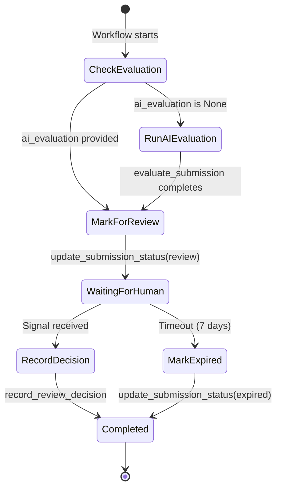
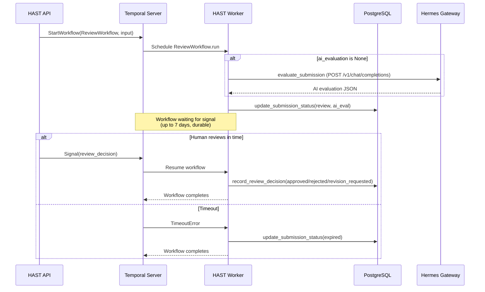

# Workflows Guide

## What is Temporal?

[Temporal](https://temporal.io) is a durable execution platform. A Temporal workflow is a function that can run for hours, days, or weeks while surviving process crashes, network failures, and server restarts. State is automatically persisted -- when the worker restarts, the workflow resumes exactly where it left off.

Key concepts used in Lecture Agent:

| Concept | How it maps |
|---------|-------------|
| **Workflow** | `ReviewWorkflow` -- the durable state machine for a submission review |
| **Activity** | Side-effect functions: `evaluate_submission`, `update_submission_status`, `record_review_decision` |
| **Signal** | `review_decision` -- external input from a human reviewer |
| **Query** | `get_status` -- read current workflow state without mutation |
| **Task Queue** | `lecture-review-queue` -- routes work to the correct worker |
| **Worker** | `hast-worker` container -- polls the task queue and executes workflows + activities |

## ReviewWorkflow Deep Dive

### State Diagram



### Workflow Code Walkthrough

The `ReviewWorkflow.run()` method executes four steps:

**Step 1 -- AI Evaluation** (conditional). If the submitting agent did not include a pre-computed `ai_evaluation`, the workflow dispatches the `evaluate_submission` activity. This activity calls Hermes Gateway to generate a structured evaluation. Timeout: 10 minutes, up to 3 retries.

**Step 2 -- Mark for Review.** The `update_submission_status` activity updates the database row to `status = 'review'` and stores the AI evaluation. This makes the submission visible to human reviewers.

**Step 3 -- Wait for Human.** The workflow enters a durable wait (`workflow.wait_condition`) for a `review_decision` signal. If no signal arrives within `REVIEW_TIMEOUT_DAYS` (default 7), the workflow catches `TimeoutError` and marks the submission as `expired`.

**Step 4 -- Record Decision.** When the signal arrives, the `record_review_decision` activity writes the human's decision, notes, and any adjusted score to the database.

### Full Lifecycle Sequence



## Activity Functions

All activities are defined in `hast/src/workflows/activities.py` and registered with the worker.

### evaluate_submission

| Property | Value |
|----------|-------|
| Input | `ReviewInput` (submission_id, content, criteria) |
| Output | `dict` (structured AI evaluation) |
| Timeout | 10 minutes (start-to-close) |
| Retries | 3 attempts |
| Heartbeat | 30 seconds |

Calls Hermes Gateway's chat completions endpoint with the submission content and criteria, requesting a structured evaluation JSON.

### update_submission_status

| Property | Value |
|----------|-------|
| Input | `dict` with `submission_id`, `status`, optional `ai_evaluation` |
| Output | None |
| Timeout | 30 seconds |
| Retries | Default (unlimited with backoff) |

Executes an `UPDATE` on `hast_submissions` to change the status and optionally store the AI evaluation.

### record_review_decision

| Property | Value |
|----------|-------|
| Input | `dict` with `submission_id`, `decision`, `reviewer_notes`, `adjusted_score`, `adjusted_evaluation` |
| Output | None |
| Timeout | 30 seconds |
| Retries | Default |

Writes the human reviewer's decision, notes, and any score adjustments to the database. Sets `updated_at` to the current time.

## Signal Handling

The `review_decision` signal is defined on the workflow class:

```python
@workflow.signal
async def review_decision(self, signal: ReviewSignal) -> None:
    self._review_signal = signal
```

When the HAST API receives a `POST /api/submissions/{id}/review`, it:

1. Looks up the `workflow_id` from the database
2. Gets a workflow handle from the Temporal client
3. Sends the signal: `handle.signal(ReviewWorkflow.review_decision, signal)`

The signal is delivered to the workflow even if the worker is temporarily down -- Temporal buffers it until the worker reconnects.

### ReviewSignal Schema

```python
@dataclass
class ReviewSignal:
    decision: str           # "approved" | "rejected" | "revision_requested"
    reviewer_notes: str     # Free-text (default: "")
    adjusted_score: float | None
    adjusted_evaluation: dict | None
```

## Timeout and Retry Policies

| Setting | Value | Configurable Via |
|---------|-------|------------------|
| Review wait timeout | 7 days | `REVIEW_TIMEOUT_DAYS` env var |
| AI evaluation timeout | 10 minutes | Hardcoded in workflow |
| AI evaluation retries | 3 attempts | Hardcoded in workflow |
| AI evaluation heartbeat | 30 seconds | Hardcoded in workflow |
| DB activity timeout | 30 seconds | Hardcoded in workflow |
| DB activity retries | Default (unlimited with exponential backoff) | Temporal defaults |

The review wait timeout is the most important tunable. In production, you may want to increase it (e.g., 30 days for end-of-semester reviews) or decrease it (e.g., 2 days for urgent compliance checks).

## Query Support

The workflow exposes a query handler for reading current state without mutation:

```python
@workflow.query
def get_status(self) -> str:
    if self._review_signal:
        return self._review_signal.decision
    return "waiting_for_review"
```

You can query this from the Temporal UI or via the Temporal CLI:

```bash
temporal workflow query \
  --workflow-id review-a1b2c3d4-... \
  --type get_status
```

## Building Custom Workflows

To add a new workflow type (e.g., an enrollment approval workflow):

### 1. Define the workflow

Create `hast/src/workflows/enrollment_workflow.py`:

```python
from temporalio import workflow
from dataclasses import dataclass

@dataclass
class EnrollmentInput:
    application_id: str
    student_id: str
    program_id: str
    # ...

@workflow.defn
class EnrollmentWorkflow:
    @workflow.run
    async def run(self, input: EnrollmentInput) -> dict:
        # Your workflow logic here
        ...
```

### 2. Define activities

Add activity functions to `hast/src/workflows/activities.py` or create a new file.

### 3. Register with the worker

In `hast/src/worker.py`, add the workflow and activities:

```python
worker = Worker(
    client,
    task_queue=settings.TEMPORAL_TASK_QUEUE,
    workflows=[ReviewWorkflow, EnrollmentWorkflow],
    activities=[
        evaluate_submission,
        update_submission_status,
        record_review_decision,
        # new activities here
    ],
)
```

### 4. Add API endpoints

Add a new router or endpoints in `hast/src/api.py` to start and interact with the workflow.

### 5. Create a Hermes skill

Create `hermes/skills/enrollment-evaluation/SKILL.md` that instructs agents to call your new endpoints.
